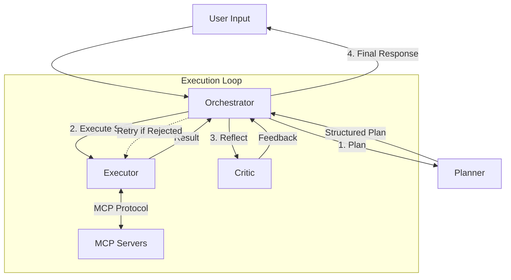

# Agent Bot (v2) - Next-Gen Multi-Agent Orchestration Framework

[]()
[]()
[]()

**Agent Bot** 是一个现代化的、基于 **Model Context Protocol (MCP)** 的多智能体协作框架。它采用了 **Planner-Executor-Critic** 架构，融合了 Claude Code 的 "Plan -> Implement -> Reflect" 工作流，旨在提供稳定、可扩展且具备自我修正能力的 Agent 开发体验。

无论是构建代码助手、数据分析机器人，还是复杂的任务自动化系统，Agent Bot 都能提供坚实的架构基础。

---

## 🌟 核心特色 (Key Features)

- **🧠 Planner-Executor-Critic 架构**: 
  - **Architect (Planner)**: 负责高层任务拆解与结构化规划。
  - **Coder (Executor)**: 负责执行具体步骤，调用工具。
  - **Reviewer (Critic)**: 负责审查执行结果，确保任务质量，形成闭环。

- **🔌 Model Context Protocol (MCP) 原生支持**:
  - 抛弃传统的 Function Calling 耦合，采用标准化的 MCP 协议集成工具。
  - 支持 **FileSystem**, **CodeAnalysis**, **ExternalServices** 等多种内置 MCP Server。
  - 工具与 Agent 逻辑彻底解耦，易于扩展和复用。

- **⚡️ 现代化的流式交互体验**:
  - 基于 `Rich` 库构建的精美终端 UI。
  - 实时展示 Agent 的思考过程、规划树和执行状态。
  - 支持流式输出，打字机效果呈现最终回复。

- **🛡️ 健壮的工程设计**:
  - **自我修正**: Critic 发现问题后，Executor 会自动重试（支持指数退避）。
  - **错误恢复**: 内置针对 LLM API (如 429 Rate Limit) 的自动重试机制。
  - **类型安全**: 全面使用 Python 类型提示和 Pydantic/Dataclass。

---

## 🏗️ 系统架构 (Architecture)



---

## 🛠️ 技术栈 (Tech Stack)

- **核心语言**: Python 3.10+
- **LLM 交互**: `openai` (Async), `tenacity` (Retry)
- **UI/CLI**: `rich`, `prompt_toolkit`
- **工具协议**: MCP (Model Context Protocol) 概念实现
- **依赖管理**: `uv` (推荐) 或 `pip`

---

## 🚀 快速开始 (Quick Start)

### 前置条件

- Python 3.10 或更高版本
- 一个有效的 OpenAI API Key (或兼容的 API 服务，如 DeepSeek, Moonshot 等)

### 安装步骤

1. **克隆仓库**
   ```bash
   git clone https://github.com/your-username/agent-bot.git
   cd agent-bot
   ```

2. **创建虚拟环境**
   ```bash
   # 使用 uv (推荐)
   uv venv
   source .venv/bin/activate
   
   # 或使用 venv
   python -m venv .venv
   source .venv/bin/activate
   ```

3. **安装依赖**
   ```bash
   # 使用 uv
   uv sync
   
   # 或使用 pip
   pip install -r requirements.txt
   ```

4. **配置环境变量**
   复制示例配置并填入你的 API Key：
   ```bash
   cp .env.example .env
   ```
   编辑 `.env` 文件：
   ```ini
   OPENAI_API_KEY="sk-xxxxxxxxxxxxxxxxxxxxxxxx"
   OPENAI_BASE_URL="https://api.openai.com/v1"  # 可选，用于自定义接入点
   OPENAI_MODEL_NAME="gpt-4-turbo"              # 默认模型
   ```

### 运行 Agent

```bash
# 使用 uv
uv run main.py

# 或直接运行
python main.py
```

---

## 📖 使用指南 (Usage)

启动后，你将进入一个交互式的 CLI 界面。

### 基础对话
直接输入你的需求，Agent 会自动规划并执行：
```text
> 帮我查询北京现在的天气，并把结果保存到 weather.txt 文件中。
```

### 切换模型 (@model)
在会话中动态切换 LLM 模型：
```text
> @gpt-4o 帮我写一个 Python 贪吃蛇游戏
```

### 引用文件 (#file)
将本地文件作为上下文提供给 Agent：
```text
> 请分析 #data/report.csv 中的销售数据
```

### 退出
输入 `exit` 或 `quit` 退出程序。

---

## 🧩 目录结构 (Directory Structure)

```
agent-bot/
├── docs/               # 文档
├── sandbox/            # Agent 的文件操作沙箱目录
├── src/
│   ├── core/           # 核心逻辑 (Agent, Planner, Executor, MCP Base)
│   ├── infra/          # 基础设施 (LLM Adapter, Logging, MCP Servers)
│   ├── interface/      # 接口层 (CLI, UI)
│   └── main.py         # 入口文件
├── .env.example        # 环境变量示例
└── README.md           # 项目说明
```

---

## 🤝 贡献指南 (Contributing)

我们非常欢迎社区的贡献！

1. Fork 本仓库。
2. 创建你的特性分支 (`git checkout -b feature/AmazingFeature`)。
3. 提交你的修改 (`git commit -m 'Add some AmazingFeature'`)。
4. 推送到分支 (`git push origin feature/AmazingFeature`)。
5. 打开一个 Pull Request。

---

## 📄 许可证 (License)

本项目采用 MIT 许可证。详情请参阅 [LICENSE](LICENSE) 文件。

---

## 📞 联系方式 (Contact)

如有任何问题或建议，欢迎提交 Issue 或通过以下方式联系：

- **Email**: contact@example.com
- **GitHub Issues**: [Issues Page](../../issues)

---

**Happy Coding with Agent Bot!** 🤖✨
